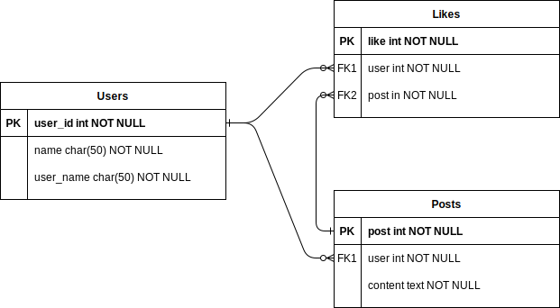

# Mini red social
---
## Problema a resolver
Se requiere una aplicación web para la gestión de una pequeña comunidad, donde diferentes usuarios podrán subir contenido en forma de posts y dar like al contenido de otros usuarios.

#### Casos de uso
* Los usuarios podrán crear posts
* Los usuarios podrán dar like a los posts de otros usuarios

---
## Arquitectura

### Modelo de datos
Se conformará por 4 entidades:
1. Users
2. Posts
3. Follows
4. likes


---
### Estructura de directorio
```
.
├── api
│   └── index.js
├── components
│   ├── likes
│   │   ├── controller.js
│   │   └── network.js
│   ├── posts
│   │   ├── controller.js
│   │   └── network.js
│   └── users
│       ├── controller.js
│       └── network.js
├── config.js
├── diagrama_fisico.svg
├── docker-compose.yml
├── LICENSE
├── middleware
│   ├── error_handler
│   │   ├── customError.js
│   │   └── index.js
│   └── log_error
│       └── index.js
├── network
│   ├── response.js
│   └── router.js
├── package.json
├── package-lock.json
├── postgres_data
├── readme.md
└── storage
    ├── likes.js
    ├── postgresql.js
    ├── posts.js
    └── users.js
```